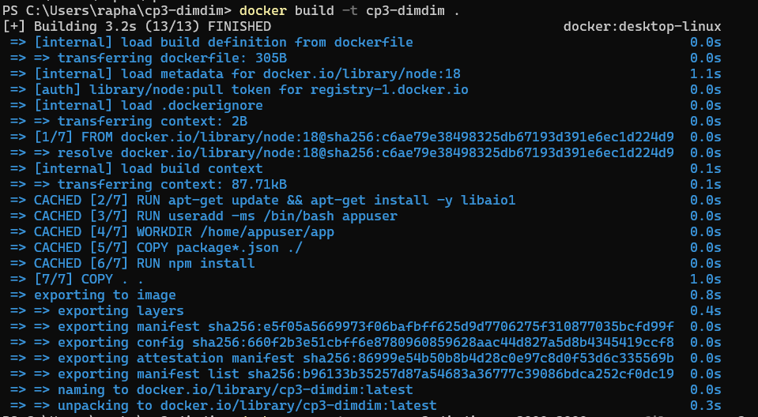
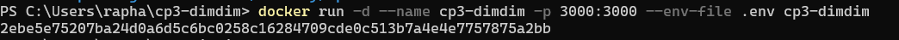
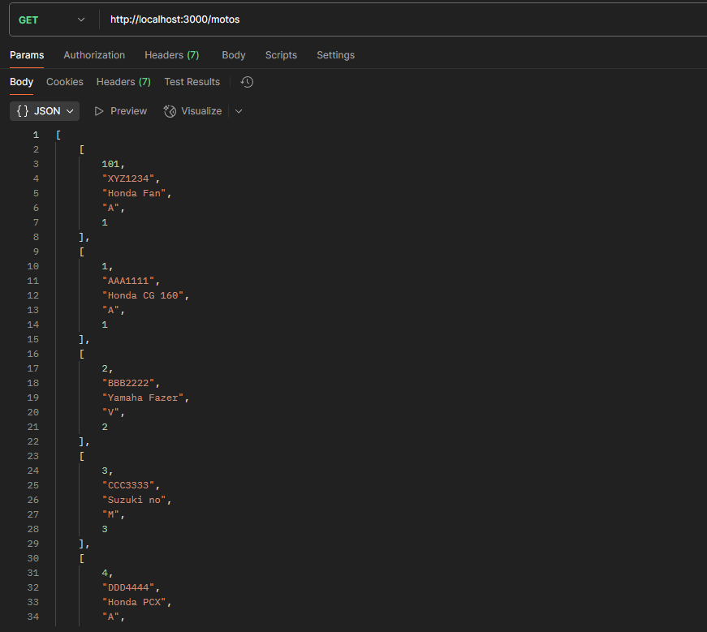
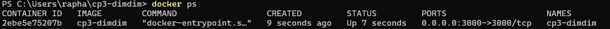
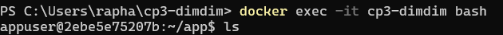
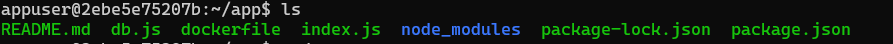
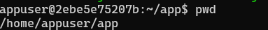
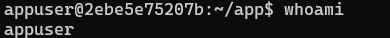

# CP3 - DimDimApp (DevOps com Docker)

## 💡 Sobre o Projeto
Aplicação Node.js conteinerizada com Docker, conectando-se a banco Oracle da FIAP. O projeto realiza um CRUD simples (ex: Motos) com persistência de dados e boas práticas de containerização, como uso de usuário não-root e variáveis de ambiente.

---

## 👥 Equipe

- Nome: Tiago Ribeiro Capela – RM: 558021
- Nome: Raphaela Oliveira Tatto – RM: 554982

---

## 📁 Estrutura do Projeto

```
dimdim-app/
├── Dockerfile
├── index.js
├── db.js
├── package.json
├── .env.example
├── README.md
└── img/
```

---

## 🧱 Tecnologias

- Node.js
- Express
- OracleDB (conexão externa: oracle.fiap.com.br)
- Docker

---

## 🐳 Como rodar o projeto

### 1. Clonar o repositório

```bash
git clone https://github.com/raphatatto/cp3-dimdim.git
cd seu-repo
```

### 2. Criar o arquivo `.env`

Crie um arquivo `.env` com:

```env
ORACLE_USER=rm123456
ORACLE_PASSWORD=sua_senha
ORACLE_CONNECTION_STRING=oracle.fiap.com.br:1521/orcl
PORT=3000
```

### 3. Build da imagem



```bash
docker build -t cp3-dimdim .
```

### 4. Rodar o container



```bash
docker run -d --name cp3-dimdim -p 3000:3000 --env-file .env cp3-dimdim
```

---

## 🔧 Funcionalidades

### Endpoint: `GET /clientes`



Retorna todos os registros da tabela `CLIENTES` no Oracle da FIAP.

---

## ✅ Testes obrigatórios

Abaixo, evidências dos comandos exigidos:

- `docker ps`  
  

- `docker exec -it cp3-dimdim bash`  
  

- `ls`  
  

- `pwd`  
  

- `whoami`  
  

---

## 📦 Observações

- Container roda como **usuário não-root** (`appuser`)
- Diretório de trabalho definido com `WORKDIR`
- Uso de `ENV`, `EXPOSE`, e `CMD` corretamente
- Banco Oracle usado: `oracle.fiap.com.br`, com conexão via `oracledb`

---

## 🔗 Link do Repositório

> https://github.com/raphatatto/cp3-dimdim.git

---

## 📄 PDF de Entrega

Arquivo `cp3_waledev.pdf` enviado via Teams, contendo:
- Nome da equipe
- Nome + RM dos membros
- Link para este repositório
